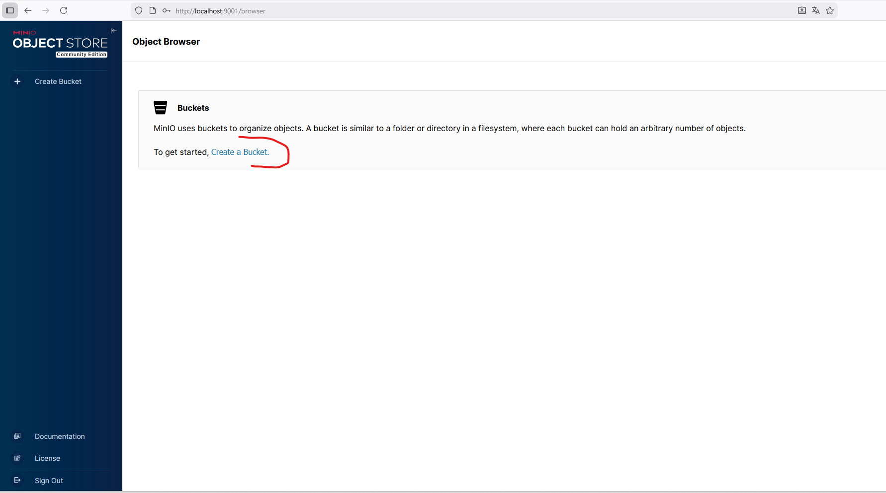
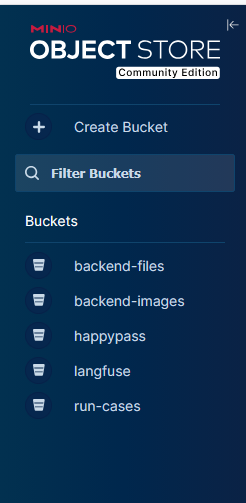
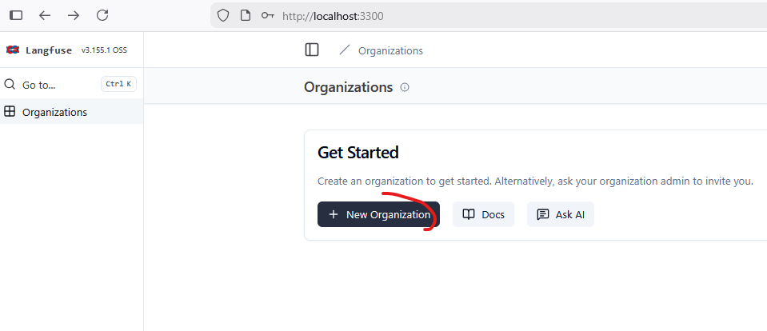
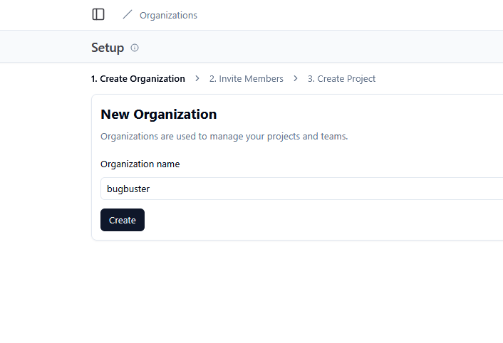
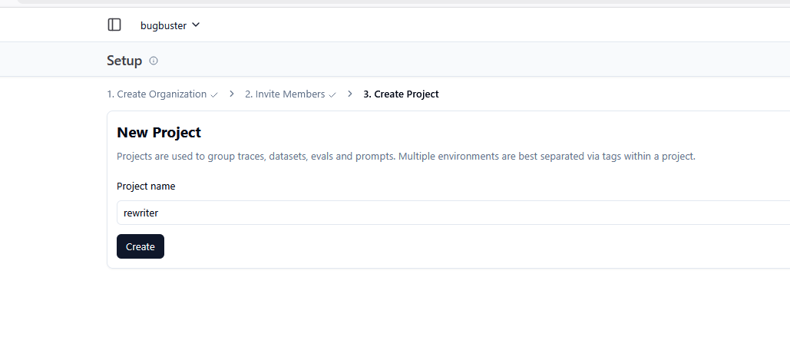
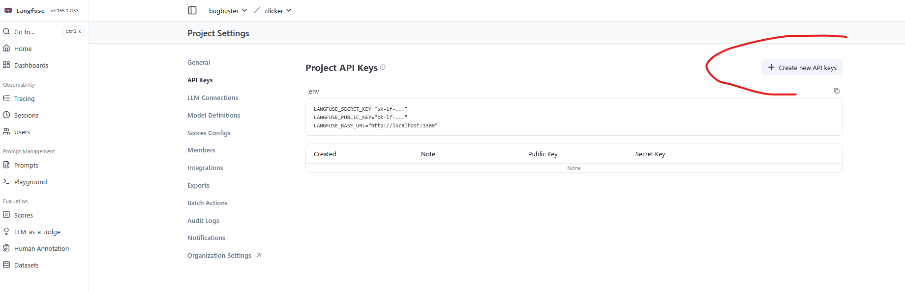

## Git LFS

This repository uses **Git LFS** for storing Playwright binaries (`playwright/driver/node.exe` and related files).
If you clone or update the repository without Git LFS, these files may be missing or corrupted, and related functionality will not work correctly.

### 1. Install Git LFS (one time per machine)

Follow the official instructions for your OS: `https://git-lfs.com`  
On Windows with Chocolatey, for example:

```bash
choco install git-lfs
git lfs install
```

If Git LFS is already installed, just ensure that it is enabled in this repo:

```bash
git lfs install
```

### 2. Clone this repository with LFS

If you have not cloned the repository yet, simply clone as usual (LFS will be used automatically after `git lfs install`):

```bash
git clone <THIS_REPOSITORY_URL>
cd bugbuster
```

Then download LFS objects explicitly (if needed):

```bash
git lfs pull
```

<details>
<summary>Deploy</summary>

## Step-by-step installation


<details>
<summary>Infrastructure</summary>

### 01 - Create network
```bash
docker network create bugbuster
```

### 02 - install minio S3, postgres, redis, rabbitmq, clickhouse

```bash
docker compose -p infrastructure -f infra/docker-compose.infrastructure.yml --env-file infra/infrastructure.env.example up -d
```

### 03 - infrastructure preparation

Open http://localhost:9001 in your browser and create the following buckets: `happypass`, `langfuse`, `run-cases`, `backend-files`, `backend-images`:





Create the following databases: portal and langfuse

```bash
docker exec -it postgres psql -U postgres -c "CREATE DATABASE portal WITH ENCODING 'UTF8';"
```

```bash
docker exec -it postgres psql -U postgres -c "CREATE DATABASE langfuse WITH ENCODING 'UTF8';"
```


</details>


<details>
<summary>Langfuse</summary>

### 01 - install langfuse

```bash
docker compose -p langfuse -f infra/docker-compose.langfuse.yml --env-file infra/langfuse.env.example up -d
```

### 02 - langfuse preparation

Open http://localhost:3300 in your browser and register any account.
Create any organization and any two projects, and generate API keys for them.
For example, the organization bugbuster, the projects clicker and rewriter.
Add the API keys to services.env.example.






</details>


<details>
<summary>Services</summary>

### 01 - services preparation

Add the API keys to services.env.example (`LANGFUSE_CLICKER_PUBLIC_KEY`, `LANGFUSE_CLICKER_SECRET_KEY`, `LANGFUSE_REWRITER_PUBLIC_KEY`, `LANGFUSE_REWRITER_SECRET_KEY`)

Add your `OPENROUTER_API_KEY` to services.env.example (`INFERENCE_API_KEY`, `SOP_REWRITER_API_KEY`)

### 02 - Build service images"
```bash
docker compose -p services -f infra/docker-compose.services.yml --env-file infra/services.env.example build
```

### 03 - Run alembic migrations (one-time)"
```bash
docker compose -p services -f infra/docker-compose.services.yml --env-file infra/services.env.example run --rm alembic upgrade head
```


### 04 - install backend, frontend_tms, clicker, rewriter, video_generate_service, playwright_viewer

```bash
docker compose -p services -f infra/docker-compose.services.yml --env-file infra/services.env.example up -d
```


</details>

## Main endpoints after startup

- **Platform (frontend)**: `http://localhost:3000`
- **Langfuse UI**: `http://localhost:3300`
- **Backend Swagger docs**: `http://localhost:7665/docs`
- **MinIO Console (files and buckets)**: `http://localhost:9001`
- **Trace Viewer (Playwright traces)**: `http://localhost:3209`

> Port values are taken from `infra/services.env.example` and the corresponding `docker-compose.*.yml` files. If you change them there, update the addresses above accordingly.

</details>


<details>
<summary>Create your first test case</summary>

## tbd


</details>