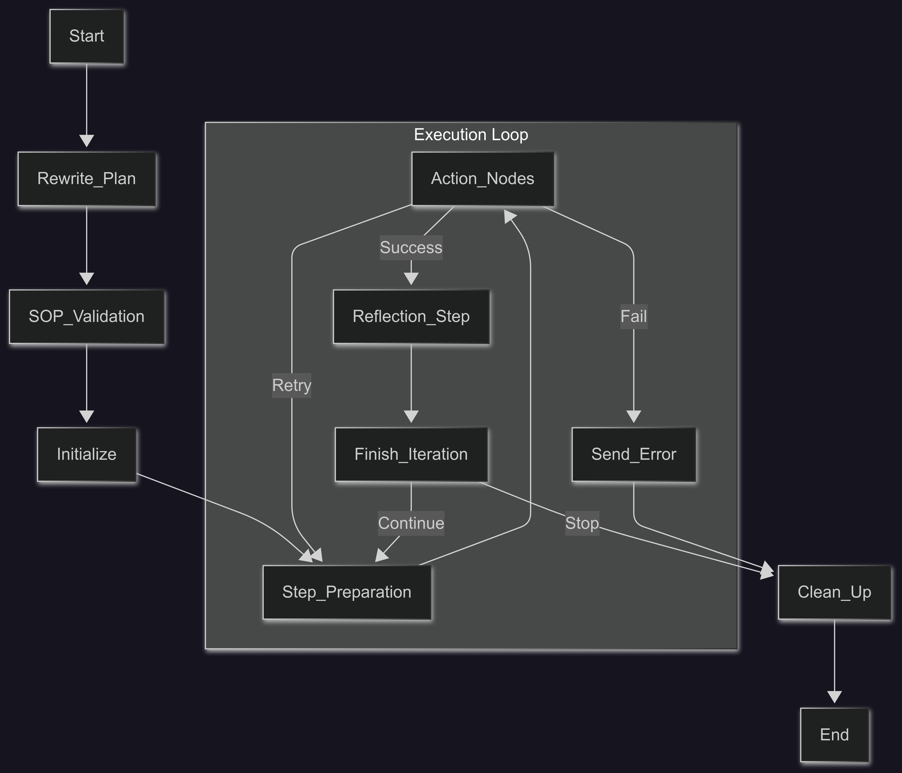

# Agent Core

This directory contains the core logic for bugbuster agent that executes QA test cases. It uses a state machine built with `langgraph` to manage the execution flow, from initializing the browser to performing actions and reflecting on the results.

## Directory Structure

-   `agent/`
    -   `models/`: Contains model definitions and a factory for creating inference clients for different models for visual grounding tasks (e.g., `tars_v15`).
    -   `reflection/`: Holds the logic for the "reflection" step, where the agent verifies the outcome of its actions using different models like Claude 3.5.
    -   `rewriter/`: Includes logic for rewriting action plans (SOPs), to convert them from natural language to structured format.
    -   `config.py`: Contains configuration constants for the agent, such as wait times and confidence thresholds.
    -   `graph.py`: The heart of the agent. It defines the `langgraph` state machine, orchestrating the entire process from setup to execution and cleanup. It initializes the environment (playwright and db sessions), manages the state, and calls the appropriate actions or processes for each step.
    -   `graph_actions.py`: Implements the browser-level and page-level actions the agent can perform, such as `CLICK`, `TYPE`, `SCROLL`, `WAIT`, `READ`, `PASTE`, and tab management. Each function takes the agent's state, executes the action using Playwright, and returns the updated state.
    -   `graph_utils.py`: Provides utility functions used by the graph, such as cleaning up temporary directories.
    -   `schemas.py`: Defines the Pydantic data models for the agent's state (`AgentState`), step state (`StepState`), and action definitions (`Action`). These schemas ensure data consistency throughout the execution graph.

## Agent Pipeline

The agent operates in a sequential pipeline, transforming a natural language test plan into browser actions and verifying the outcomes. The entire process is managed by a state machine defined in `graph.py`.

### 1. Rewrite Action Plan
Initially, a human-written action plan (e.g., "Click the login button, then type 'admin' into the username field") is processed by the `rewriter`. This component converts the natural language instructions into a structured, machine-readable format that the agent can execute.

### 2. Validate Action Plan
After rewriting, the structured plan goes through a validation step. The `sop_validation` function (located in `utils.py`) checks the plan for correctness. This includes ensuring that every action has the required parameters and that `READ`/`PASTE` actions are used logically (e.g., a value read with a specific key is eventually pasted). If the plan is invalid, the process stops; otherwise, it's sent to the agent.

### 3. Graph Execution
The validated, structured action plan is then passed to the main execution graph, which iterates through each step.

-   **Initialization**: The `init_browser` function in `graph.py` sets up the necessary environment, including a Playwright browser instance, a database session, and the initial agent state.
-   **Execution Loop**: The graph enters a loop that processes one step of the action plan at a time.
    -   **Step Preparation**: Prepares the state for the current action, including taking a "before" screenshot.
    -   **Action Execution**: Based on the step's `action_type`, the graph calls the appropriate function from `graph_actions.py`. These functions use Playwright to interact with the browser. If an action fails, the graph will retry it up to three times. If it continues to fail, the process is routed to an error-handling node.
    -   **Reflection**: After a successful action, the `reflection_step` is called. It takes an "after" screenshot and, if validation instructions are provided for the step, uses a reflection model (e.g., Claude 3.5) to verify that the action produced the expected result.
    -   **Finish Iteration**: The results and artifacts (screenshots, logs, etc.) for the completed step are saved. The graph then checks if there are more steps in the plan. If so, it loops back to prepare the next step.
-   **Cleanup**: Once all steps are completed, or if a critical error occurs, the `clean_up_and_finish` function is called to close the browser, save final logs and video recordings, and release all resources.